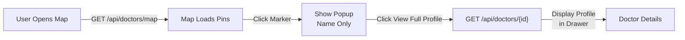

# Map Feature API Schema Documentation

## Overview
The map feature uses a two-endpoint approach for efficient data loading and detailed profile fetching.

---

## 1. Map Endpoint (Lightweight)

### Endpoint
```
GET /api/doctors/map
```

### Purpose
Fetches minimal doctor data with coordinates for rendering map pins. Filtered by active filters from the frontend.

### Query Parameters
```
?doctors_main.stateName=Maharashtra
?hprSpecialitys=General Medicine
?gpsProximity=lat:27.25&lng:76.16&radius=50
?globalSearch=hanuman
... (existing filter parameters)
```

### Response Format

**Success (200)**
```json
{
  "items": [
    {
      "id": "doctor_001",
      "doctorName": "Dr. Hanuman Lal",
      "doctors_work.facilityLat": 27.249643,
      "doctors_work.facilityLong": 76.163893
    },
    {
      "id": "doctor_002",
      "doctorName": "Dr. Priya Singh",
      "doctors_work.facilityLat": 27.250000,
      "doctors_work.facilityLong": 76.164000
    }
  ],
  "next_cursor": null
}
```

**Error (400, 401, 500)**
```json
{
  "error": "Error message",
  "status": 400
}
```

### Field Definitions

| Field | Type | Required | Description |
|-------|------|----------|-------------|
| `id` | `string` / `number` | ✅ | Unique doctor identifier for profile lookup |
| `doctorName` | `string` | ✅ | Doctor's full name (displayed on marker hover) |
| `doctors_work.facilityLat` | `float` | ✅ | Latitude (-90 to +90) of work facility |
| `doctors_work.facilityLong` | `float` | ✅ | Longitude (-180 to +180) of work facility |

### Filtering Rules
- Apply the same filter logic as existing `/api/doctors` endpoint
- Exclude doctors with `null`, `0`, or invalid coordinates
- Support pagination with `next_cursor` if dataset is large

### Example Request
```bash
curl -X GET "http://localhost:3000/api/doctors/map?doctors_main.stateName=Maharashtra&limit=100" \
  -H "Authorization: Bearer <token>"
```

---

## 2. Full Profile Endpoint (Existing)

### Endpoint
```
GET /api/doctors/{id}
```

### Purpose
Fetches complete doctor profile details when user clicks "View Full Profile" in the map popup.

### Response Format
```json
{
  "id": "doctor_001",
  "doctorName": "Dr. Hanuman Lal",
  "gender": "Male",
  "hprSpecialitys": "General Medicine",
  "systemOfMedicine": "Allopathy",
  "doctorType": "Allopathy",
  "hospitalName": "Test Hospital",
  "hprWorkDetails___districtName": "Indore",
  "hprWorkDetails___stateName": "Madhya Pradesh",
  "hprWorkDetails___facilityOwnership": "Private",
  "registrationNumber": "REG123",
  "registrationYear": 2020,
  "registrationStatus": "Verified",
  "workExperienceInYear": 5,
  "phoneNumber": "+91-9999999999",
  "email": "test@example.com",
  "emailOfficial": "test.official@example.com",
  "isRegistrationVerified": true,
  "isPhoneVerified": true,
  "isEmailVerified": true,
  "doctors_work.facilityLat": 27.249643,
  "doctors_work.facilityLong": 76.163893,
  "doctors_main.governmentEmployee": false,
  ... // all other fields
}
```

---

## 3. Frontend Workflow



### Step-by-Step
1. **Map Initialization**: Frontend calls `/api/doctors/map` with active filters
2. **Render Pins**: Markers displayed with doctor initials in circles
3. **Marker Click**: Small popup shows basic info (name, specialty, hospital, location)
4. **View Profile**: User clicks "View Full Profile" button
5. **Fetch Details**: Frontend calls `/api/doctors/{id}`
6. **Display Drawer**: Full profile opens in a side drawer

---

## 4. Validation Rules

### Backend Must Validate
✅ **Coordinate Validation**
- Latitude: `-90` ≤ value ≤ `+90`
- Longitude: `-180` ≤ value ≤ `+180`
- Must be `number` type, not string
- Must not be `NaN` or `null`

✅ **Data Validation**
- `id` must be unique
- `doctorName` must not be empty
- Exclude records with missing/invalid coordinates

✅ **Security**
- Verify authentication token
- Apply user-level access controls
- Sanitize filter parameters

### Frontend Error Handling
- If no doctors found: Display "No Geo-located Doctors Found" message
- If API fails: Show retry button
- If coordinates invalid: Skip that record, log warning

---

## 5. Alternative Field Names

Backend can use flexible field names. Frontend normalizes to standard names:

**Coordinates:**
```
doctors_work.facilityLat  →  facility_lat  →  facilityLat
doctors_work.facilityLong →  facility_long →  facilityLong
```

**Doctor Name:**
```
doctorName  →  doctor_name  →  name
```

**Example Response with Alternate Names:**
```json
{
  "id": "doctor_001",
  "doctor_name": "Dr. Hanuman Lal",
  "facility_lat": 27.249643,
  "facility_long": 76.163893
}
```

---


